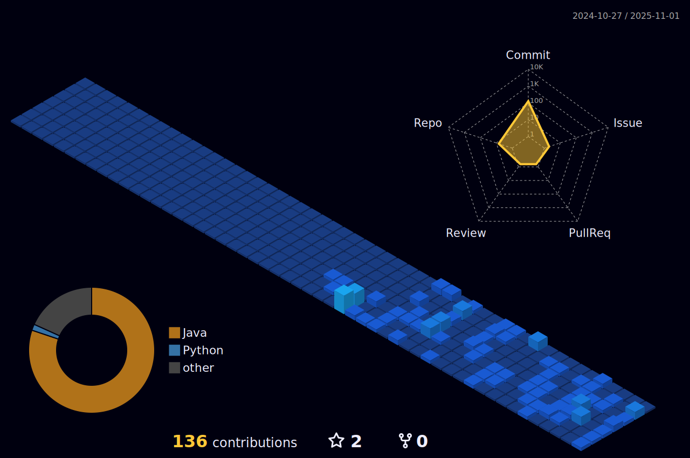

  

---

  
   
  

  

  

## My Skills

#### Main Stack:

#### Secondary Stack:

#### Studying in this moment:

&nbsp;

#### Databases:

#### Workstation Tools:

&nbsp;
&nbsp;

&nbsp;
&nbsp;

## Contacts:

